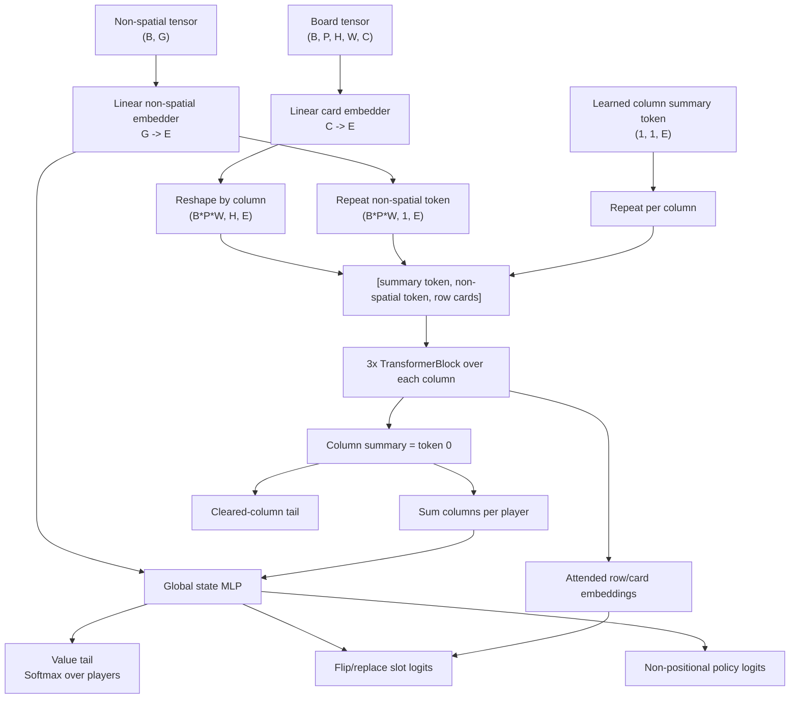

# SkyNet Architecture Review

This document reviews `skynet.py` as of the current repository state. The short version: the core idea is good. The `EquivariantSkyNet` architecture is intentionally small, uses attention in a way that respects the natural set structure of Skyjo columns, and its row/column permutation behavior checks out. The biggest opportunities are not "make it huge"; they are tightening the observation contract, training setup, output heads, and model invariance tests.

## Current Architecture

`skynet.py` defines two model families:

- `SimpleSkyNet`: a flat MLP baseline over concatenated board and non-board features.
- `EquivariantSkyNet`: the main architecture, designed to be invariant/equivariant to Skyjo board symmetries.

The current training path in `main.py` uses `EquivariantSkyNet` with roughly this configuration:

```python
embedding_dimensions=32
global_state_embedding_dimensions=64
num_heads=1 or 2
players=2
```

At `embedding_dimensions=32`, `global_state_embedding_dimensions=64`, and `num_heads=2`, the model has about 26k parameters, so this is a genuinely small network.

## Input Representation

The board input has shape:

```text
(batch, players, rows, columns, card_features)
```

For the normal two-player Skyjo setup:

```text
(batch, 2, 3, 4, 17)
```

The final axis is a one-hot card/status representation:

- 15 card values, indexed from `-2` through `12`
- hidden card marker
- cleared column marker

The non-spatial input has shape:

```text
(batch, GAME_SIZE)
```

Today `GAME_SIZE` includes the visible top/discard card, discard counts, current action phase, scores, and last revealed turn markers. It does not directly include every item in the full `Skyjo` tuple, such as the deck vector, current turn count, or countdown.

## EquivariantSkyNet Data Flow



In code terms:

1. Each card/status one-hot vector is projected into an embedding.
2. Each column is processed independently as a short sequence containing:
   - learned column summary token
   - repeated non-spatial state token
   - the three card slots in that column
3. Three self-attention blocks update the column sequence.
4. The column summary token becomes that column's embedding.
5. Column embeddings are summed across columns for each player.
6. Player board summaries and the non-spatial embedding are concatenated and passed through a global MLP.
7. The global embedding feeds:
   - a value head predicting winner probabilities over players
   - a policy head for non-board actions
   - a policy head for per-slot flip/replace actions
   - a cleared-column auxiliary head

## Symmetry Behavior

The intended symmetry story is mostly implemented correctly.

Rows within a column are processed by attention with no row positional encoding. That means swapping cards inside a column swaps the corresponding attended card embeddings. The column summary remains invariant to row order.

Columns are pooled with a sum, so the global board/value representation is invariant to column order. The policy head applies the same slot-logit function to each card embedding, so swapping columns swaps the corresponding flip/replace logits.

I verified this numerically with random model weights:

```text
row value max diff:       ~6e-8
row policy equiv max diff: ~1e-7
col value max diff:        0
col policy equiv max diff: ~1e-7
```

So the architecture is not merely hoping the network learns the symmetry. For rows within columns and columns within a player board, the symmetry is built into the computation.

## What Is Strong

The model is appropriately small. Skyjo has a compact state and a small action space, so a 26k-parameter model plus MCTS/self-play is a reasonable place to be.

The symmetry prior is valuable. You are right that card order inside a column does not matter for board evaluation, and column order does not matter for scoring. Encoding those facts directly should improve sample efficiency.

Using attention inside a column is defensible. A column's key tactical feature is the relationship among its three cards: matching values, hidden/revealed status, and clear potential. A small set-attention block is a natural fit.

The policy tail is better than a flat action MLP. It shares parameters across board slots, which is exactly what you want for flip and replace actions.

## Highest Priority Improvements

### 1. Fix the model output contract drift

`SkyNetOutput` is defined as four tensors:

```text
value, points, policy, cleared_columns
```

`EquivariantSkyNet.forward` returns four tensors, but `SimpleSkyNet.forward` returns only three. This makes the baseline model incompatible with `SkyNetPrediction.from_skynet_output` and the modern loss path.

Recommendation: make every model return the same four-output structure. If a head is intentionally absent, return a correctly-shaped zero tensor.

### 2. Stop recreating the optimizer every training step

`train.py` creates `torch.optim.Adam(...)` inside the per-batch `train()` function. That resets Adam's momentum/variance state every batch, which throws away one of the main reasons to use Adam.

Recommendation:

- create the optimizer once per training run
- keep optimizer state in checkpoints
- consider `AdamW` instead of Adam with coupled weight decay
- add optional gradient clipping
- add a learning-rate schedule

This is probably more important than changing the neural architecture.

### 3. Clarify the value target and loss

The value head currently applies `Softmax(dim=-1)` and is trained with MSE against winner/outcome targets. That is not wrong, but it is a mixed convention:

- If the target is a winner distribution, train logits with cross entropy or KL-style soft-label cross entropy.
- If the target is expected utility per player, do not force a softmax over players unless the utility is truly a probability simplex.
- If score/rank matters, add a real score or point-difference head instead of returning zeros for `points_output`.

For Skyjo, I would strongly consider predicting:

- win probability
- expected final score or score differential
- maybe expected rank for multiplayer

Winner-only targets are sparse and high variance. Score-aware auxiliary targets should help the model learn board evaluation faster.

### 4. Add explicit observation features for game timing and public card accounting

The model sees `GAME_SIZE`, not the full `Skyjo` tuple. It gets top/discards/action/scores/last-revealed markers, but not clearly normalized current turn count, countdown, or remaining draw/deck count.

Recommendation:

- make an explicit `Observation` builder rather than exposing raw `Game`
- include normalized current turn number or turns-since-last-reveal
- include countdown/end-round state directly
- include public remaining-card estimates/counts if they are legally observable
- normalize raw count/score features

The network should not have to reverse-engineer game phase or deck pressure from partially raw counters.

### 5. Add invariance/equivariance tests

The symmetry behavior is central to the architecture. It deserves tests.

Add tests that:

- swap two rows within one column and check value invariance
- swap two rows within one column and check flip/replace logit equivariance
- swap columns and check value invariance
- swap columns and check flip/replace logit equivariance
- confirm masks stay aligned after action-index permutations

This guards the most important design property from accidental refactors.

## Architecture Improvements

### Use a proper small transformer/set block

`TransformerBlock` currently uses pre-norm self-attention, residuals, and optionally an MLP. In `EquivariantSkyNet`, `mlp_ratio=None`, so the column processor is attention-only.

Recommendation: use a tiny feed-forward sublayer, for example:

```text
LayerNorm
Multi-head self-attention
residual
LayerNorm
Linear -> GELU/SiLU -> Linear
residual
```

Even with `mlp_ratio=2`, the model remains tiny. This gives each token a stronger pointwise nonlinear transform after information mixing.

### Replace repeated named blocks with `ModuleList`

The three column attention blocks are declared as `column_attention`, `column_attention2`, and `column_attention3`.

Recommendation:

```python
self.column_attention_blocks = nn.ModuleList(
    [
        TransformerBlock(...),
        TransformerBlock(...),
        TransformerBlock(...),
    ]
)
```

This makes depth configurable and reduces copy/paste risk.

### Derive policy-tail dimensions from the model

`EquivariantPolicyLogitTail` defaults to `rows=3`, `columns=4`, and `non_positional_actions=4`. That matches Skyjo today, but the enclosing model already knows these dimensions.

Recommendation: pass `rows`, `columns`, and non-positional action count explicitly from `EquivariantSkyNet`.

### Consider a DeepSets baseline

A very strong small baseline would be:

```text
card embedding -> per-column DeepSets/SAB -> column embedding -> board DeepSets -> heads
```

For only three cards per column and four columns per board, attention is affordable. But a DeepSets-style sum/mean pooling baseline is useful because it is simpler and may be faster on CPU/MPS for such tiny sequences.

### Keep attention, but do not over-index on FlashAttention-style efficiency

PyTorch's `nn.MultiheadAttention` can use optimized scaled-dot-product attention when possible, and `need_weights=False` is already the right direction for performance. But this model's sequences are extremely short. For Skyjo, the main bottleneck is likely Python/MCTS/self-play overhead and batching, not attention FLOPs.

## Implementation Quality Issues

### `batch_mask_and_renormalize_policy_probabilities` mixes NumPy and Torch

The function is typed as NumPy-in/NumPy-out but uses `torch.where`. That should be converted to `np.where` or rewritten as a tensor utility.

### Manual policy softmax should use Torch utilities where possible

`SkyNetPrediction.from_skynet_output` manually computes NumPy softmax. This is okay for inference, but it duplicates logic and can become inconsistent with training.

Recommendation: use `torch.softmax(policy_logits, dim=-1)` before converting, or centralize this conversion.

### Prediction should use inference mode

`predict()` does not wrap the forward pass in `torch.inference_mode()`. That means PyTorch may track gradients during inference if the caller forgets to set context.

Recommendation:

```python
with torch.inference_mode():
    output = self.forward(...)
```

### Masking with `-1e10` is brittle for mixed precision

Using `-1e10` works in float32. It is less robust if you later use fp16/bfloat16 or export/compile paths.

Recommendation:

```python
logits = logits.masked_fill(~mask.bool(), torch.finfo(logits.dtype).min)
```

or use `-torch.inf` where downstream code handles it safely.

### There is a lot of dead/commented architecture code

The current model has several commented-out alternatives. For experimentation this is understandable, but it makes the true architecture harder to audit.

Recommendation: move experiments into named model variants or config flags, and keep `skynet.py` focused on active modules.

## Suggested Next Architecture

I would keep the same high-level architecture and make it cleaner:

```text
Observation encoder
  Card/status embedding
  Normalized public game features
  Optional public-card-count features

Column set encoder
  [column summary token, game/context token, 3 card tokens]
  2-3 small pre-norm attention+MLP blocks

Board/player encoder
  Sum/mean pool columns per player
  Optional small set block over columns before pooling
  Preserve player turn order unless you intentionally model opponent permutation

Global trunk
  Small MLP over current player board, opponent summaries, game context

Heads
  Value/win logits
  Expected score or score-difference head
  Shared per-slot flip/replace policy head
  Non-positional policy head
  Optional cleared-column auxiliary head
```

This is still small, but it makes the output semantics and game information cleaner.

## Sources And Context

- PyTorch documents that `nn.MultiheadAttention` is a reference implementation and can use optimized `scaled_dot_product_attention()` when possible: <https://docs.pytorch.org/docs/2.12/generated/torch.nn.MultiheadAttention.html>
- PyTorch's scaled dot product attention docs describe the available fused implementations and backend limitations: <https://docs.pytorch.org/docs/2.12/generated/torch.nn.functional.scaled_dot_product_attention.html>
- Deep Sets is the standard reference for permutation-invariant set functions: <https://papers.neurips.cc/paper/6931-deep-sets>
- Set Transformer is the standard reference for attention-based permutation-invariant set modeling: <https://proceedings.mlr.press/v97/lee19d.html>
